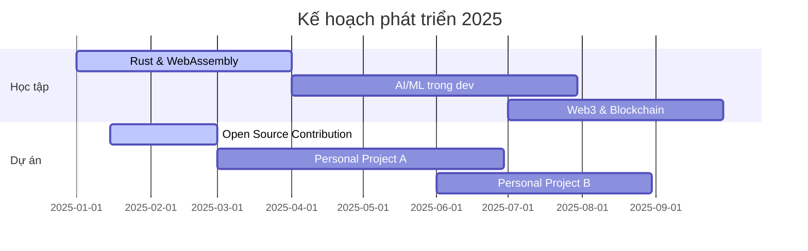

# 👋 Xin chào, Tôi là [Tên Của Bạn] 


## 🚀 Full Stack Developer | 💡 Problem Solver | 🌐 Web Enthusiast

> *"Code là thơ ca của thời đại số hóa."*

---

### 🛠 Tech Stack

```javascript
const techStack = {
    frontend: ["JavaScript", "TypeScript", "React", "Vue", "Angular", "HTML5", "CSS3", "TailwindCSS"],
    backend: ["Node.js", "Express", "NestJS", "PHP", "Laravel", "Python", "Django"],
    database: ["MongoDB", "MySQL", "PostgreSQL", "Redis"],
    devOps: ["Docker", "Kubernetes", "AWS", "GCP", "CI/CD", "GitHub Actions"],
    tools: ["Git", "Webpack", "Vite", "Figma", "Adobe XD", "Postman"]
};
```

---

### 📊 GitHub Stats

<div align="center">
  
  
</div>

---

### 🏆 Certifications & Achievements

- 🥇 Google Cloud Certified - Professional Cloud Architect
- 🥈 AWS Certified Solutions Architect
- 🥉 Microsoft Certified: Azure Developer Associate
- 🏅 Top 5% Stack Overflow Contributor in [Chuyên ngành của bạn]

---

### 🔭 Dự án nổi bật

<div align="center">
  <a href="https://github.com/yourusername/project1">
    
  </a>
  <a href="https://github.com/yourusername/project2">
    
  </a>
</div>

---

### 📝 Bài viết mới nhất
<!-- BLOG-POST-LIST:START -->
- [Xây dựng API với Node.js và Express](https://dev.to)
- [Tối ưu hóa hiệu suất ứng dụng React](https://dev.to) 
- [Triển khai ứng dụng với Docker và Kubernetes](https://dev.to)
<!-- BLOG-POST-LIST:END -->

---

### 🎯 Đường lối phát triển trong năm 2025



---

### 📫 Kết nối với tôi

<div align="center">
  <a href="https://www.linkedin.com/in/yourusername">
    
  </a>
  <a href="https://twitter.com/yourusername">
    
  </a>
  <a href="https://dev.to/yourusername">
    
  </a>
  <a href="mailto:your.email@example.com">
    
  </a>
</div>

---

<div align="center">
  
  
  ### 🎵 Đang nghe
  [](https://open.spotify.com/user/yourusername)
</div>

---

⭐️ From [yourusername](https://github.com/yourusername)
